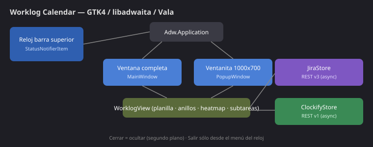

# Worklog Calendar — GTK 4 / libadwaita (Vala)

Aplicación de escritorio para **Ubuntu 24.04 (GNOME)** que muestra una **vista
semanal** (Domingo a Sábado) con tus **worklogs** de **Jira** y **Clockify**.
Es la reescritura nativa en **GTK 4 + libadwaita + Vala** del plasmoide
`Jira / Clockify Worklog Calendar` que hicimos para KDE Plasma 5.

Funciona de dos maneras al mismo tiempo:

1. **Aplicación completa** — una ventana de escritorio redimensionable
   (`Worklog Calendar`) que abrís desde el menú de aplicaciones o el dock.
2. **Ventanita flotante** — un **reloj blanco** en la barra superior; al
   hacerle clic se abre una ventana chica de **1000 × 700 px** con toda la
   pantalla de Jira/Clockify a escala (planilla, anillos, heatmap, sincronizar
   y un botón para saltar a la app completa).

La app **sigue corriendo en segundo plano** cuando cerrás cualquiera de las dos
ventanas (desde el dock o el botón ✕). Para **salir de verdad** hacés **clic
derecho en el reloj de la barra superior → Salir** (o `Ctrl+Q` / el menú
hamburguesa de la app → *Salir*).



---

## Qué incluye

| Componente | Descripción |
|---|---|
| **La planilla** | Grilla semanal de 30 min por fila. Modo **9h** (09:00–18:00) o **24h**. Arrastrá para crear, clic para editar, arrastrá un bloque para moverlo, los bordes para redimensionar. Botón derecho → *Duplicar / Editar*. |
| **Tres fuentes** | **Jira** (lila), **Clockify** (verde) o **Jira / Clockify** combinado (día partido al medio). El menú de la barra de herramientas cambia entre ellas. |
| **Los anillos** | Gauges de **Sprint** (% transcurrido) y **Horas** (% cargado sobre el total del sprint), con animación de llenado. |
| **El heatmap** | Tabla mensual de horas por día (fila Clockify + fila Jira), coloreada de gris→rojo→amarillo→verde. Clic en un día salta a esa semana. |
| **Tabla de subtareas** | Lista de tus subtareas (JQL configurable) con estado, horas restantes y menú para cambiar de estado o abrir en Jira. |
| **Sincronizar** | Botón ↻ que refresca la semana visible. En modo combinado aparece **Jira → Clockify** para replicar cada worklog de Jira como entrada de Clockify. |
| **Configurable** | Preferencias completas (credenciales, JQL, sprint, ventana, segundo plano) guardadas en **GSettings**. |

El panel inferior (anillos / subtareas / heatmap) se cambia con la tira de
botones verticales a su derecha.

---

## Instalación

### Dependencias (Ubuntu 24.04)

```bash
sudo apt install meson ninja-build valac \
  libgtk-4-dev libadwaita-1-dev libsoup-3.0-dev libjson-glib-dev libgee-0.8-dev \
  gnome-shell-extension-appindicator
```

(o `./install.sh --deps`).

> El reloj en la barra superior usa el protocolo **StatusNotifierItem**. En
> GNOME hace falta la extensión **Ubuntu AppIndicators** (paquete
> `gnome-shell-extension-appindicator`, ya viene en Ubuntu). Activala con
> *Extensiones* / *GNOME Tweaks* y reiniciá la sesión si hiciera falta.

### Compilar e instalar

```bash
cd worklog-gtk
./install.sh            # instala en ~/.local (sin root)
./install.sh --run      # instala y lanza
./install.sh --system   # instala en /usr (con sudo)
./install.sh --uninstall
```

O a mano con Meson:

```bash
meson setup build --prefix ~/.local
ninja -C build
meson install -C build
```

Luego buscá **Worklog Calendar** en el menú de aplicaciones, o ejecutá
`io.github.peperina.WorklogCalendar`.

---

## Primer uso

1. Abrí la app → menú hamburguesa (↗ arriba a la derecha) → **Preferencias**
   (o el ⚙ del pie).
2. Pestaña **Jira**: cargá *Site URL*, *Email* y *API token*
   ([generá uno acá](https://id.atlassian.com/manage-profile/security/api-tokens)).
   Probá la conexión.
3. Pestaña **Clockify** (opcional): pegá tu *API key*
   (*Clockify → Profile → Settings → API*). El workspace se resuelve solo.
4. Cerrá Preferencias y tocá ↻ para sincronizar la semana.

La documentación detallada está en [`docs/`](docs/):

- [`docs/CONFIGURACION.md`](docs/CONFIGURACION.md) — todas las preferencias.
- [`docs/JIRA.md`](docs/JIRA.md) — endpoints, sprint y estrategias.
- [`docs/CLOCKIFY.md`](docs/CLOCKIFY.md) — API key, workspace, sync.

---

## Comportamiento en segundo plano y "Salir"

- Cerrar la ventana (✕ o desde el dock) **la oculta**; la app sigue viva en la
  barra superior. Esto se controla con la preferencia *Seguir en segundo plano
  al cerrar* (por defecto **on**).
- **Clic en el reloj blanco** → abre la ventanita flotante.
- **Clic derecho en el reloj** → menú con *Mostrar reloj*, *Abrir aplicación*
  y **Salir**.
- *Salir* (o `Ctrl+Q`, o el menú de la app) cierra el proceso de verdad.

Si desactivás *Seguir en segundo plano*, cerrar la última ventana termina la app
como cualquier programa normal.

---

## Arquitectura (resumen)

```
src/
  main.vala            Punto de entrada
  Application.vala     Adw.Application: orquesta ventanas, stores y el reloj
  Config.vala          Wrapper sobre GSettings
  Http.vala            Cliente async sobre libsoup3
  JiraStore.vala       Jira Cloud REST v3 (worklogs, sprint, subtareas, CRUD)
  ClockifyStore.vala   Clockify REST v1 (entries, proyectos, tags, CRUD, sync)
  Models.vala          Estructuras de datos
  Util.vala            Helpers de fecha/JSON/color
  CalendarGrid.vala    La planilla (Cairo + gestos)
  RingGauge.vala       Anillo donut animado
  SprintGauges.vala    Anillos Sprint + Horas
  MonthHeatmap.vala    Heatmap mensual
  SubtaskTable.vala    Tabla de subtareas
  Jira/ClockifyEditDialog.vala  Modales de crear/editar/borrar
  WorklogView.vala     Compositor de toda la UI (lo usan ambas ventanas)
  Windows.vala         MainWindow + PopupWindow
  PreferencesWindow.vala  Adw.PreferencesWindow
  TrayIcon.vala        StatusNotifierItem + dbusmenu (el reloj de la barra)
data/
  *.gschema.xml        Esquema de configuración
  app.desktop.in       Lanzador
  *.svg                Iconos (reloj blanco)
```

Los *stores* son la única fuente de verdad; cada uno emite `changed()` y la UI
se re-renderiza. Todo el I/O de red es asíncrono (no bloquea la UI).

---

## Licencia

MIT — ver [LICENSE](LICENSE).
